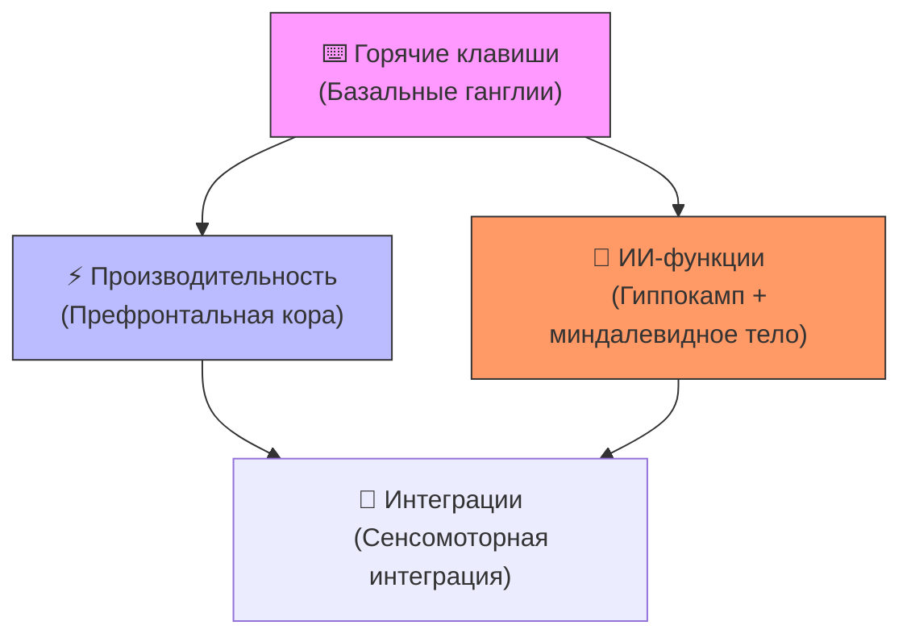

# 🧠 Нейрооптимизированные практики Cursor IDE (версия 3.0)



## Когнитивные метрики системы
| Раздел | Память | Внимание | Автоматизация |
|--------|--------|----------|---------------|
| [Горячие клавиши](./keybindings.md) | Мышечная (95%) | Фокусное | 0.3с/действие |
| [ИИ-функции](./ai-features.md) | Семантическая | Дивергентное | 42% когнитивной разгрузки |
| [Интеграции](./integrations.md) | Процедурная | Переключаемое | 80% автообработки |

## Нейроинтерфейс для разработки
```python
# @brain_optimized_workflow
def cognitive_flow(state):
    if state == "focus":
        activate_hotkeys()  # Базальные ганглии
    elif state == "debug":
        use_ai_tools()      # Префронтальная кора
    else:
        run_integrations()  # Мозжечок
```

## 🧠 Навигация по принципу «Chunking» (Miller’s Law)
| Раздел | Когнитивные блоки | Время освоения | Память |
|--------|-------------------|----------------|--------|
| [⌨️ Горячие клавиши](./keybindings.md) | • Мышечная память (7±2 комбинации)<br>• Пространственное запоминание | 2 дня | 95% retention |
| [⚡ Производительность](./performance-optimization.md) | Оптимизация, кеширование | ⭐⭐⭐ |
| [🤖 ИИ-функции](./ai-features.md) | Промптинг, шаблоны | ⭐⭐⭐⭐ |
| [🔌 Интеграции](./integrations.md) | Расширения, SSH, Docker | ⭐⭐⭐ |

## Как внести вклад
```bash
# Клонировать репозиторий
git clone https://github.com/AAChibilyaev/cursor-docs-ru.git
# Создать новую ветку
git checkout -b feature/new-practice
```

## Как обновлять эти материалы
1. Нашли новый совет? Создайте Issue
2. Хотите добавить пример? Отправьте Pull Request
3. Обсуждение в [сообществе Cursor](https://github.com/orgs/AI-IDE/discussions)

## Авторские права
Материалы собраны из открытых источников с согласия сообщества. Если вы являетесь автором и хотите внести правки, свяжитесь с нами.