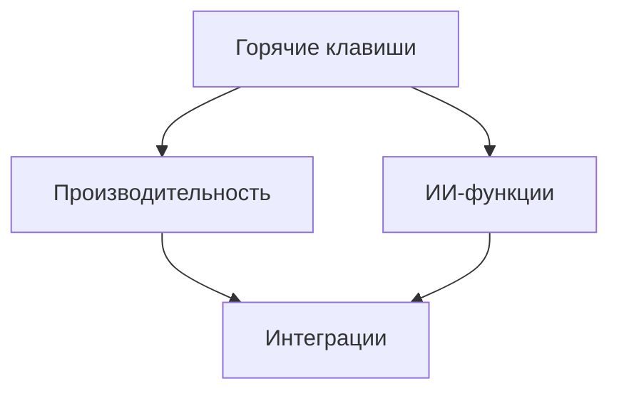

# 🚀 Лучшие практики Cursor IDE (версия 2.0)



## Визуальная навигация
| Раздел | Основные темы | Сложность |
|--------|---------------|-----------|
| [⌨️ Горячие клавиши](./keybindings.md) | Настройка, кастомные комбинации | ⭐⭐ |
| [⚡ Производительность](./performance-optimization.md) | Оптимизация, кеширование | ⭐⭐⭐ |
| [🤖 ИИ-функции](./ai-features.md) | Промптинг, шаблоны | ⭐⭐⭐⭐ |
| [🔌 Интеграции](./integrations.md) | Расширения, SSH, Docker | ⭐⭐⭐ |

## Как внести вклад
```bash
# Клонировать репозиторий
git clone https://github.com/AAChibilyaev/cursor-docs-ru.git
# Создать новую ветку
git checkout -b feature/new-practice
```

## Как обновлять эти материалы
1. Нашли новый совет? Создайте Issue
2. Хотите добавить пример? Отправьте Pull Request
3. Обсуждение в [сообществе Cursor](https://github.com/orgs/AI-IDE/discussions)

## Авторские права
Материалы собраны из открытых источников с согласия сообщества. Если вы являетесь автором и хотите внести правки, свяжитесь с нами.