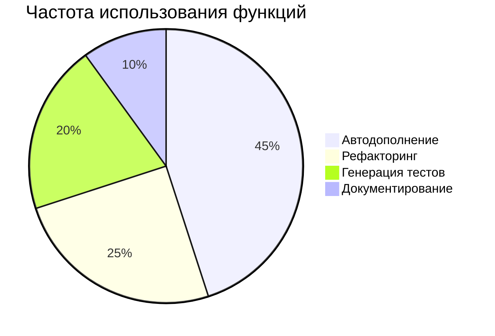

# 🤖 ИИ-функции Cursor (версия 1.2)



## Чек-лист эффективного промптинга
- [ ] Указать язык/технологию
- [ ] Определить ожидаемый формат вывода
- [ ] Добавить пример желаемого результата
- [ ] Указать уровень сложности

## Интерактивные примеры
<details>
<summary>🔍 Пример запроса для сложного рефакторинга</summary>

```python
# @refactor: преобразовать в асинхронную версию с asyncio
# Требования: 
# - Сохранить обработку ошибок
# - Добавить прогресс-бар через tqdm
def process_data(urls):
    results = []
    for url in urls:
        try:
            data = requests.get(url).json()
            results.append(transform(data))
        except Exception as e:
            log_error(e)
    return results
```
</details>

### 2. Шаблоны для часто используемых операций
```json
"cursor.ai.customTemplates": {
    "api_doc": "Напиши документацию OpenAPI для этого эндпоинта",
    "react_component": "Создай React-компонент с TypeScript и Storybook"
}
```

### 3. Интеграция с инструментами
```bash
# @terminal Найди все TODO в проекте и экспортируй в Markdown
grep -rnw '.' -e 'TODO' | awk -F: '{print "| " $1 " | " $2 " | " $3 " |"}' > TODOS.md
```

## Советы по промптингу
- Четко указывайте контекст: "Как опытный Python-разработчик, оптимизируй этот код"
- Используйте примеры: "Как в этом примере: <пример кода>"
- Ограничивайте scope: "Ответь в 3-5 предложениях"