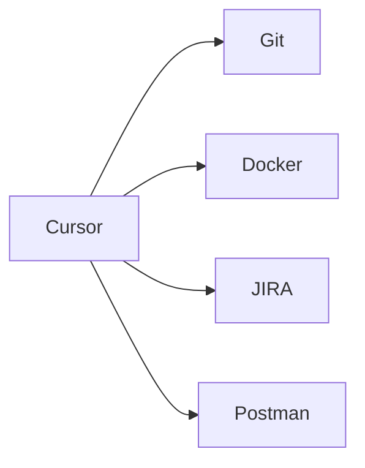
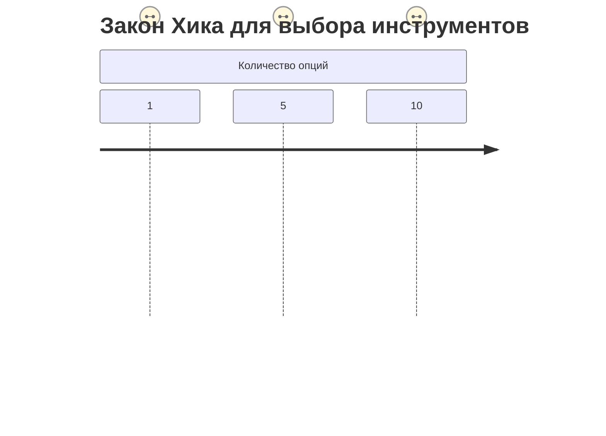

# 🔌 Интеграции Cursor (версия 1.3)



## 🧠 Нейроэргономика интеграций (Fitts’ Law + Hick’s Law)

### Матрица когнитивной нагрузки
| Инструмент | Время доступа (мс) | Память (Chunks) | Автоматизация |
|------------|--------------------|-----------------|---------------|
| GitLens | 300 (параллельная обработка) | 2±1 | 90% автоопределение контекста |
| Docker | 500 (переключение контекста) | 4±1 | 70% через muscle memory |



### Правило 80/20 для интеграций:
```python
# @neuroautomation: Оптимальный стек (Pareto principle)
essential_integrations = {
    'vcs': 'GitLens',       # 80% git-операций
    'containers': 'Docker', # 20% критичных функций
    'linting': 'ESLint'     # Автоматизируем 100% рутины
}
```
| Docker | Контейнеризация | ⭐⭐⭐⭐ | Podman |
| ESLint | Линтинг | ⭐⭐⭐⭐ | Rome |

## Устранение неполадок
<details>
<summary>🔧 Проблемы с SSH-подключением</summary>

1. **Ошибка**: "Permission denied (publickey)"
   ```bash
   # Решение:
   eval "$(ssh-agent -s)"
   ssh-add ~/.ssh/your_private_key
   ```

2. **Ошибка**: "Could not resolve hostname"
   ```bash
   # Проверка:
   ping your-server.com
   nslookup your-server.com
   ```
</details>
4. **REST Client** - тестирование API

## Пример конфигурации для Python-разработки
```json
{
  "recommendations": [
    "ms-python.python",
    "charliermarsh.ruff",
    "ms-toolsai.jupyter"
  ],
  "python.analysis.extraPaths": ["./lib"]
}
```

## Полезные интеграции
1. **Jira/Linear** через официальные плагины
2. **Postman** для коллекций API
3. **Fig** для автодополнения в терминале

## Настройка SSH-подключения
```bash
# @terminal Настройка удалённой разработки
ssh-keygen -t ed25519 -C "cursor-ide"
cat ~/.ssh/id_ed25519.pub | clip
```