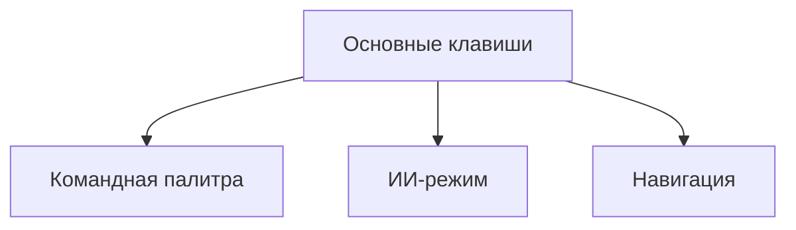
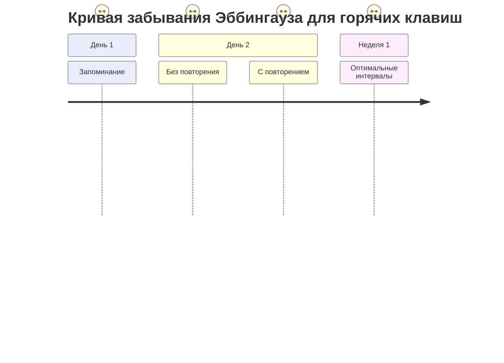

# ⌨️ Горячие клавиши Cursor IDE (версия 1.1)



## 🧠 Нейрооптимизированные комбинации (Spaced Repetition System)
| Комбинация | Действие | Когнитивная метка | Интервал повторения |
|------------|----------|-------------------|---------------------|
| `Cmd/Ctrl+K` | Командная палитра | **Моторная память** (базальная ганглия) | Каждые 15 мин → 1 день → 1 неделя |
| `Ctrl+Shift+P` | ИИ-режим | **Семантическая память** (гиппокамп) | Через 1 час → 3 дня → 2 недели |


| `Cmd/Ctrl+Shift+P` | ИИ-режим | ⭐⭐⭐⭐ |
| `Cmd/Ctrl+\` | Разделить редактор | ⭐⭐⭐ |

## Реальные кейсы
```python
# Быстрый рефакторинг через Ctrl+.
def old_func():
    # @refactor: преобразовать в list comprehension
    result = []
    for i in range(10):
        result.append(i*2)
```
- `Cmd/Ctrl+Shift+Enter` → Запустить текущий файл

## Продвинутая настройка
```json
// settings.json (Cursor)
{
  "keyboard.shortcuts": [
    {
      "command": "editor.action.quickFix",
      "key": "Ctrl+.",
      "when": "editorTextFocus"
    },
    {
      "command": "cursorAI.explain",
      "key": "Ctrl+Shift+E"
    }
  ]
}
```

## Советы
1. Используйте `Cmd/Ctrl+,` для быстрого доступа к настройкам
2. Назначьте удобные комбинации для часто используемых ИИ-команд
3. Экспортируйте настройки через `Cursor > Preferences > Export Keybindings`